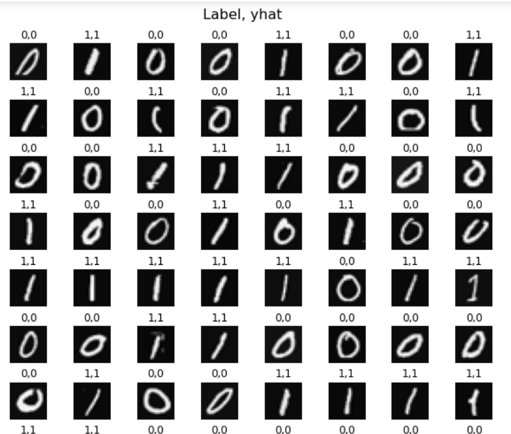
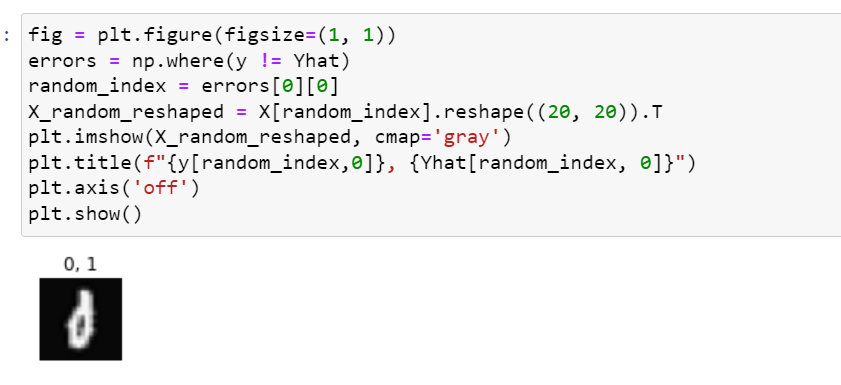

# Handwritten Digit Recognition: Binary Digits (0 and 1)

This project focuses on the recognition of handwritten binary digits, specifically 0 and 1, using machine learning techniques. Developed as part of the Machine Learning course assignment by Andrew Ng at Stanford University, the project demonstrates the application of supervised learning to solve a real-world problem.

## Dataset

The data set contains 1000 training examples of handwritten digits

## Key steps in the project include:

Data preprocessing, including normalization and feature scaling.
Implementation of logistic regression to train the model.
Evaluation using metrics such as accuracy and confusion matrix.
This project serves as a practical implementation of foundational machine learning concepts, showcasing their relevance in digit recognition and other classification tasks.

## Prerequisites
Python (3)
Libraries: NumPy, pandas, matplotlib, scikit-learn

