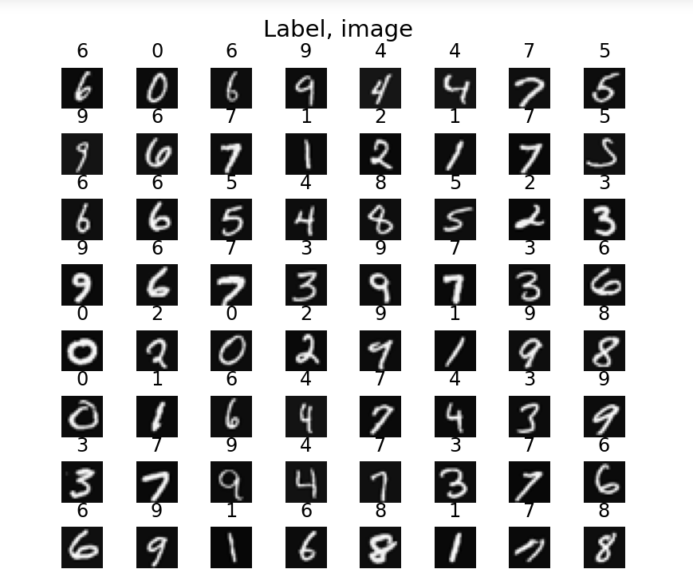
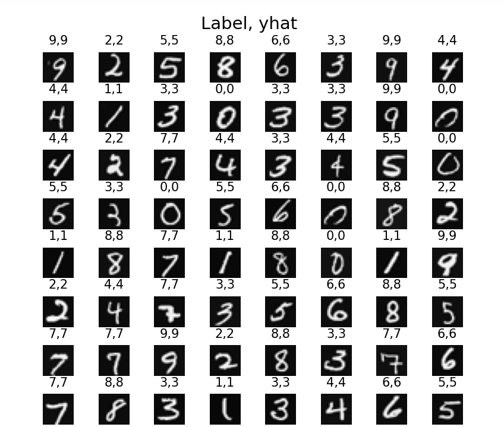
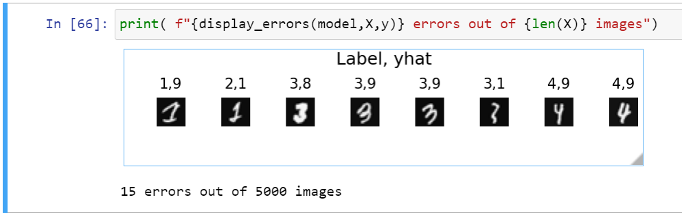

# Handwritten Digit Recognition: Multi-Digit Classification (0–9)
### 99% Accuracy on 5000 Images
This project focuses on the recognition of handwritten digits ranging from 0 to 9 using advanced machine learning techniques. Developed as part of the Machine Learning course assignment by Andrew Ng at Stanford University, the project highlights the application of supervised learning to solve real-world problems in pattern recognition.

## Dataset
The dataset contains 5000 training examples of handwritten digits (0–9), each represented as 20x20 grayscale images, making it suitable for multi-class classification.

## Key Steps in the Project Include:
Data Preprocessing

Resizing and normalizing images to ensure uniformity.
Feature extraction and scaling for optimal model performance.
Model Implementation

Logistic regression with one-vs-all (OvA) classification for multi-class recognition.
Exploring advanced models like neural networks for improved accuracy.
Model Evaluation
Performance metrics such as accuracy, precision, recall, and F1-score.
Confusion matrix analysis for deeper insights into model predictions.

This project serves as a hands-on implementation of essential machine learning concepts and their relevance in digit recognition and similar multi-class classification tasks.

## Prerequisites
Python (3)
Libraries: NumPy, pandas, matplotlib, scikit-learn

Results

