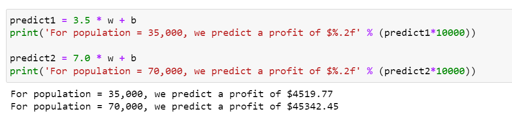

# Restaurant Franchise Profit Prediction

This project is a machine learning model designed to predict the profitability of restaurant franchises based on features such as location, operational costs, customer demographics, and sales data. By leveraging data analysis and predictive algorithms, the project aids in identifying potential success factors for franchises.

> **Note**: This project was part of an online course assignment from the Machine Learning course by Andrew Ng, Stanford University.

This project is a machine learning model designed to predict the profitability of restaurant franchises based on features such as location, operational costs, customer demographics, and sales data.

## Features

- **Data Analysis**: Preprocessing and exploratory data analysis to uncover trends and correlations.
- **Machine Learning Models**: Implements regression and predictive techniques to forecast profits.
- **Visualization**: Provides clear and informative charts for insights and model performance.
- **Scalability**: Designed to handle data from multiple franchises efficiently.

